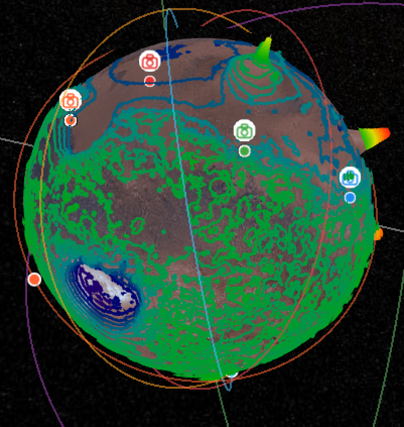

# Explore Mars!

An Interactive Planetary Map of Mars. Built from NASA MOLA data; streams 21GB of terrain tiles at multiple zoom levels.

Directly inspired by Casey Handmer's fantastic Mars [altimetry](https://caseyhandmer.wordpress.com/2024/02/16/global-terrain-map-of-mars-at-7-m-resolution/) and [hydrology](https://caseyhandmer.wordpress.com/2018/11/29/mars-global-hydrology-at-full-mola-resolution/) blog posts. This project uses his hydrology imagery and likely would not exist without him.

## Live Demo: [Explore Mars!](https://exploremars.app/)
Let me know your thoughts: [Feedback Form](https://docs.google.com/forms/d/e/1FAIpQLSd4wnJ2-OcTDWPtvChp4ArYbJQUmbjtKuYSV-YifaBysNzBcQ/viewform?usp=publish-editor)

## Gory Technical Details: [Blog Post](https://hoeksemaa.github.io/2026/03/06/explore-mars.html)

---

## Features

- 3D globe using MOLA elevation data
- 2GB of Viking surface imagery at 232m/px resolution
- 19GB of Handmer terraformed imagery at sharper resolution than Viking
- Topographic contour lines
- 2,000+ searchable named features — craters, volcanoes, canyons
- Rover positions with photo links (Curiosity, Perseverance, Opportunity, Spirit)
- Active orbital satellites with trajectory animations

---

## Data sources

| Data | Source |
|------|--------|
| Elevation | [NASA MOLA MEGDR](https://pgda.gsfc.nasa.gov/products/62) |
| Surface Imagery | Viking MDIM 2.1 via [OpenPlanetaryMap s3 bucket endpoint](http://s3-eu-west-1.amazonaws.com/whereonmars.cartodb.net/viking_mdim21_global/{z}/{x}/{y}.png) |
| Terraformed Imagery | AKA Hydrology Imagery. Simulated by [Casey Handmer](https://caseyhandmer.wordpress.com/2018/11/29/mars-global-hydrology-at-full-mola-resolution/)  |
| Named features | [IAU Gazetteer of Planetary Nomenclature](planetarynames.wr.usgs.gov) via [endpoint](https://asc-planetarynames-data.s3.us-west-2.amazonaws.com/MARS_nomenclature_center_pts.kmz) |
| Rover positions | NASA MMGIS: [Perseverance](https://mars.nasa.gov/mmgis-maps/M20/Layers/json/M20_traverse.json) and [Curiosity](https://mars.nasa.gov/mmgis-maps/MSL/Layers/json/MSL_traverse.json) positions |

---

## Built with

- CesiumJS
- Vite
- TypeScript
- Vercel
- CloudFront
- AWS S3
